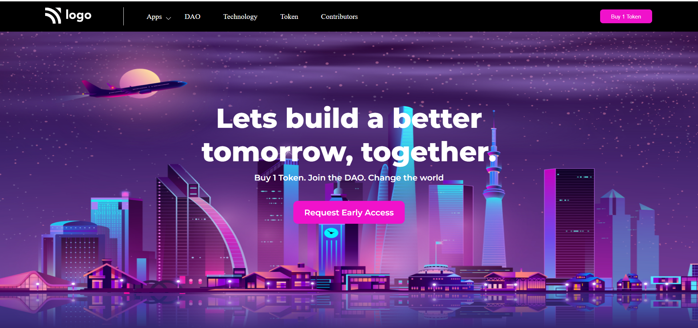

# **Crypto Landing page**

>By Subrata

-----
#### Live Deployed Website : [here](https://digital-marketing-landingpages.netlify.app/)

---
### What I learned from this Project?

- This project was a very good learning experience for me.
- I learned how to use css position(Relative & Absolute) property.
- I learned about CSS Pseudo Elements ::before, and ::after
- I learned about background image property  .

---
#### How the website looks ike
---

***

